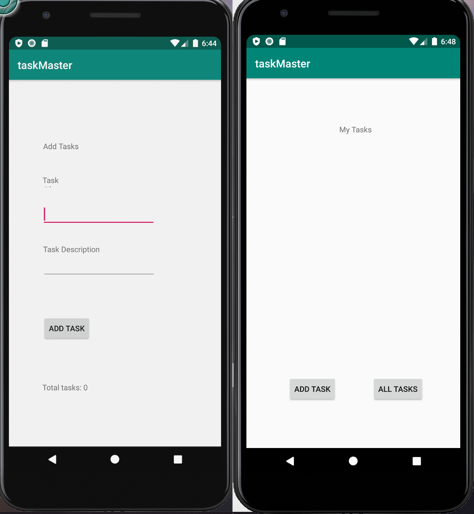
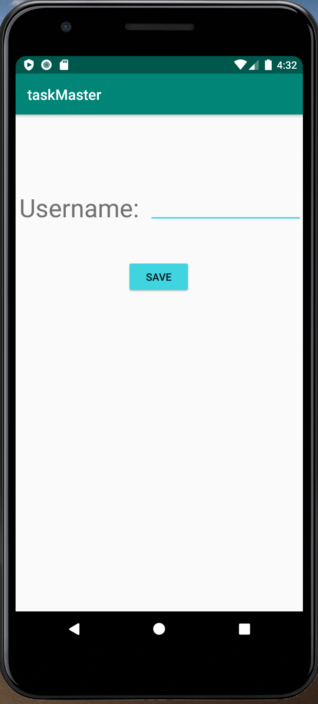
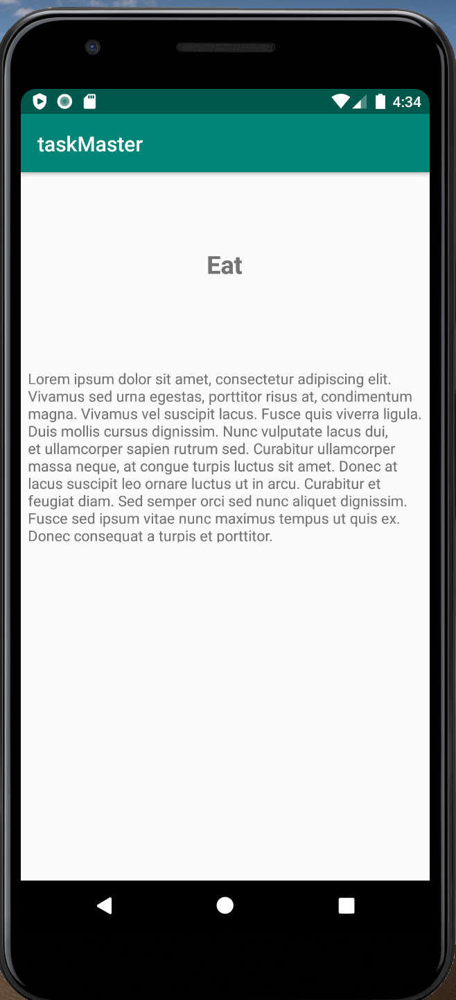
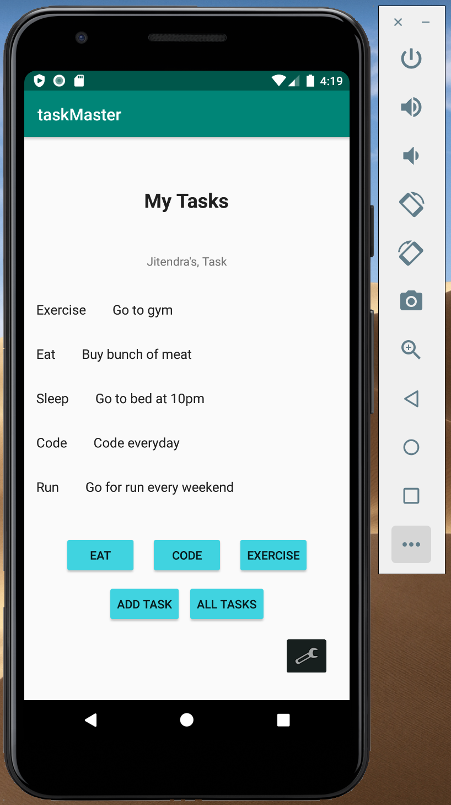
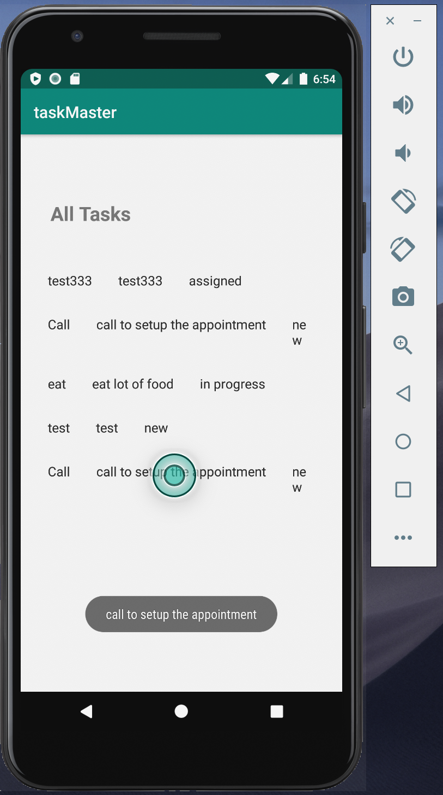

## Task Master application

### Lab 26: Beginning TaskMaster

Home page: Home page displays the heading at the top of the page, and image that mocks the my task view
and buttons at the bottom of the page to go to add task and all tasks page.

Add a task page: In add a task page user can type the title of the task and the description of the task.
When the user hits the submit button, displays submitted label on the page.

All task page: Displays images with a back button.

### Lab 27: Adding Data to TaskMaster

Task Detail Page: Displays the detail of the task and the title of the task in this page. When the
user selects the specific task title, this page opens up with the details of the tasks user pick.

Task list: On the home page, three different task titles are displayed as a button. When the user
clicks on it, it goes to task detail page which shows the same title user chose on the task detail
page.

Settings page: Added setting button on the home page. When the user clicks on the setting button, it
takes to the setting page in which user can add their username. When the user clicks on save, it saves
the username and displays as "{username}'s task" above the three task button on the home page.

### Lab 28: RecyclerViews for Displaying Lists

Recycler View: Home page displays the recycler view for the list of different task saved by the user.
When the user taps on any of the task, it take to the Task detail page which display the title and the
description of the task that the user picks.

### Lab 33: Recycler View to All Task page and Toast

All task displays recycler view showing all the task added by the user. When the user taps on
any of the task row, the toast view pops up showing the description of the task selected by the user.

